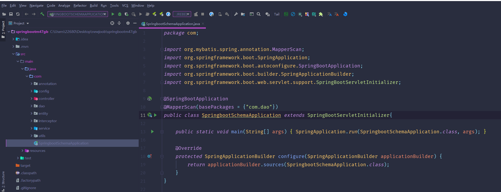
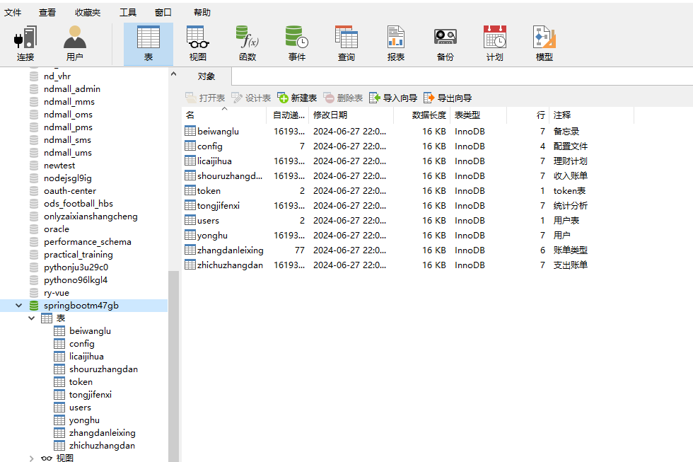
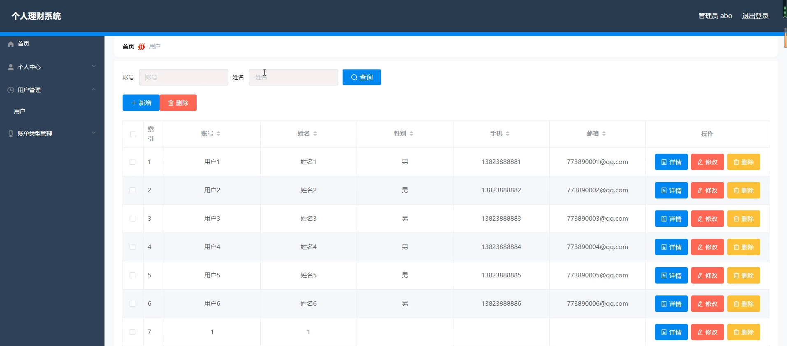
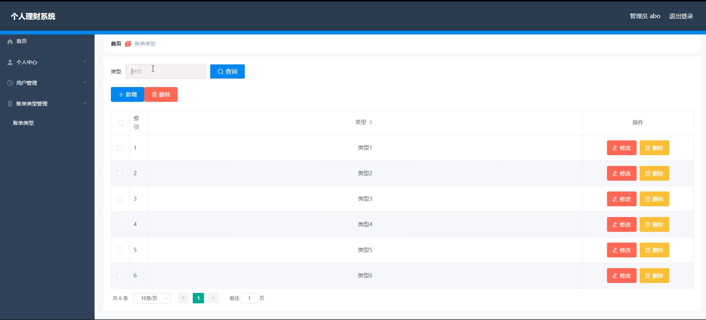
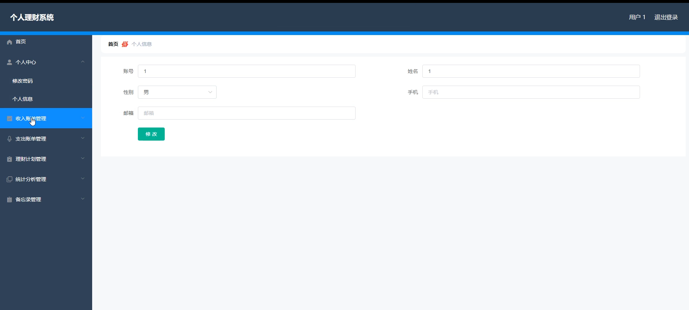
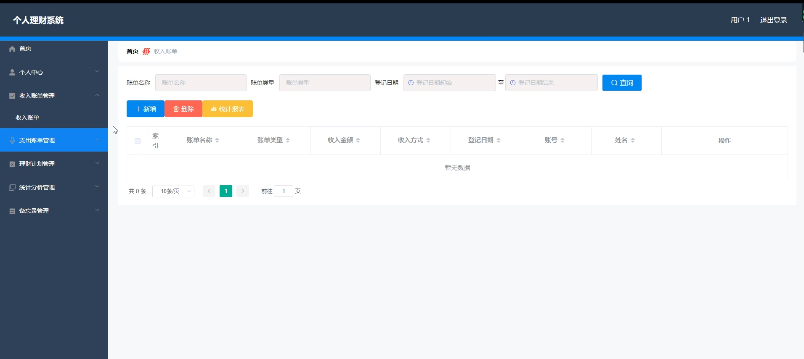
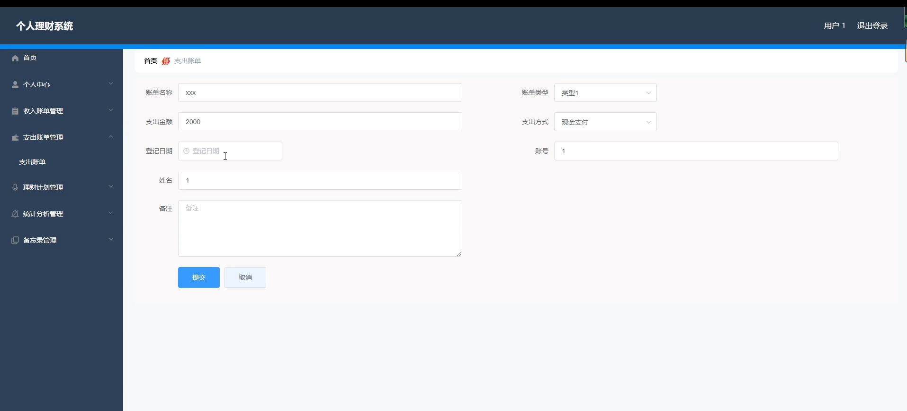
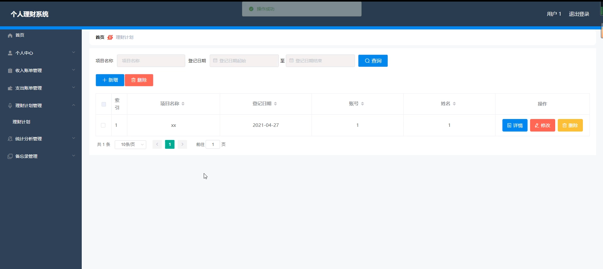
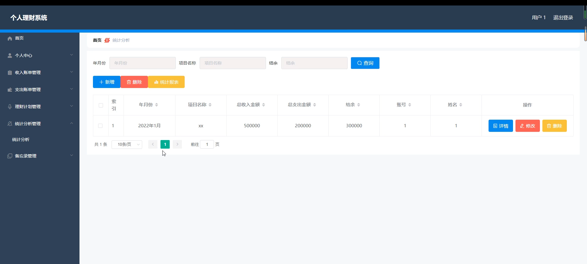
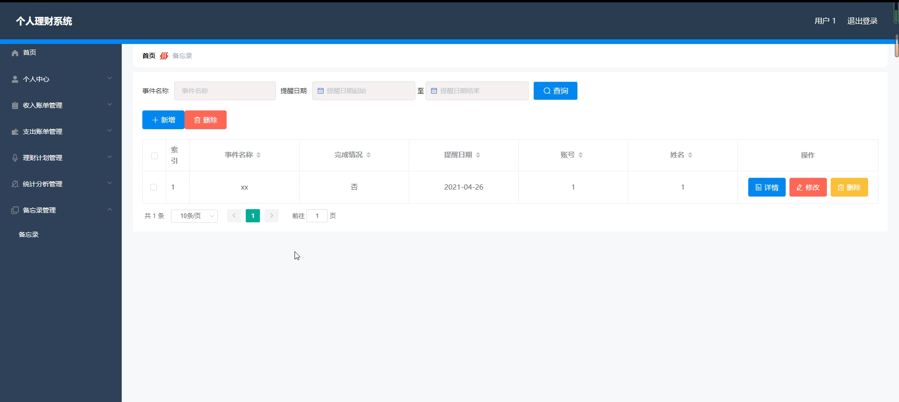

# 基于springboot的个人理财系统

---
### 👉作者QQ ：1556708905 微信：zheng0123Long (支持定制修改、部署调试、定制毕设)

### 👉接网站建设、小程序、H5、APP、各种系统等

---

#### 介绍

我开发了一个基于SpringBoot的个人理财系统，该系统旨在帮助用户更好地管理和规划个人财务，提升理财能力和效率。系统拥有两种角色，分别是管理员角色和用户角色，通过各自的功能模块实现全面的财务管理和监控。管理员负责系统管理和用户维护，而用户则可以通过多样化的功能进行财务记录、理财计划和统计分析。

#### 技术栈

后端技术栈：Springboot+Mysql+Maven

前端技术栈：Vue+Html+Css+Javascript+ElementUI

开发工具：Idea+Vscode+Navicate

#### 系统功能介绍

管理员角色  

个人中心：管理员可以在个人中心查看和编辑个人信息，包括修改密码和更新联系方式，确保个人信息的准确性和安全性。  
用户管理：管理员可以管理用户信息，包括用户的注册、删除和信息修改，确保用户数据的准确性和及时更新。  
账单类型管理：管理员可以添加、修改和删除账单类型，确保账单分类的合理性和规范性，为用户提供更精准的账单记录和统计。  

用户角色

个人中心：用户可以在个人中心查看和编辑个人信息，包括修改密码和更新联系方式，确保个人信息的准确性和安全性。  
收入账单管理：用户可以记录和管理各种收入账单，包括工资、奖金、投资收益等，方便用户全面掌握收入情况。  
支出账单管理：用户可以记录和管理各种支出账单，包括生活费用、购物消费、医疗费用等，帮助用户理清支出明细。  
理财计划管理：用户可以制定和管理理财计划，包括储蓄计划、投资计划等，帮助用户科学规划财务目标。  
统计分析管理：用户可以对收入和支出账单进行统计分析，生成各种报表和图表，帮助用户直观了解财务状况，发现理财问题。  
备忘录管理：用户可以记录各种重要的财务备忘信息，如还款日期、重要支出提醒等，防止遗忘重要财务事件。  

#### 系统作用

管理员的作用  

系统维护：管理员通过管理用户和账单类型，确保系统的正常运行和数据的准确性。  
数据管理：管理员可以及时更新和维护系统数据，确保用户的账单分类准确，提升系统的使用体验。  
用户管理：管理员负责管理用户信息，确保用户数据的安全和系统的稳定运行。  

用户的作用

财务记录：用户可以通过系统详细记录和管理收入和支出账单，全面掌握财务情况。  
理财规划：用户可以制定和管理理财计划，科学规划财务目标，提高理财能力。  
统计分析：用户可以通过统计分析功能直观了解财务状况，发现问题并及时调整理财策略。  
备忘管理：用户可以记录重要的财务备忘信息，防止遗忘重要的财务事件，提高财务管理的精确度和效率。  

#### 系统功能截图

代码结构

数据库表

登录

用户管理

账单类型

用户端个人信息

收入账单管理

支出账单管理

理财计划

统计分析管理

备忘录管理

#### 总结

基于SpringBoot的个人理财系统通过角色分工和多样化的功能模块，满足了用户对财务管理的需求。管理员通过系统维护和数据管理，确保系统的稳定运行和数据的准确性；用户则可以通过详细的账单记录、理财规划和统计分析，全面掌握财务情况，提高理财能力。该系统不仅优化了个人财务的管理流程，还提升了用户的财务管理水平和理财效率，为用户提供了一个科学、高效、便捷的个人理财平台。

#### 使用说明

创建数据库，执行数据库脚本 修改jdbc数据库连接参数 下载安装maven依赖jar 启动idea中的springboot项目

后台地址：http://localhost:8080/springbootm47gb/admin/dist/index.html

管理员  abo 密码 abo

